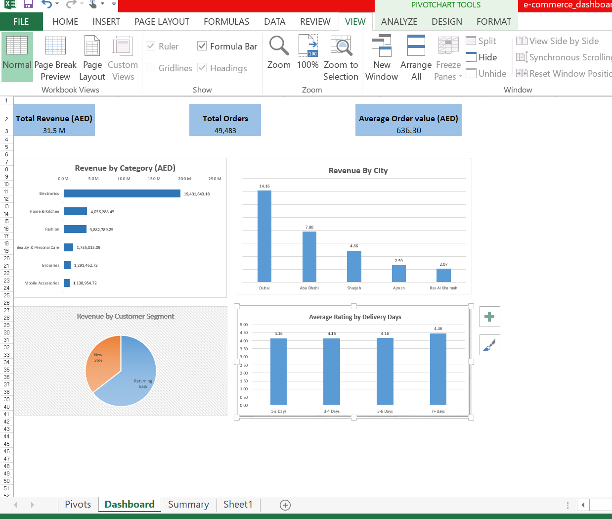
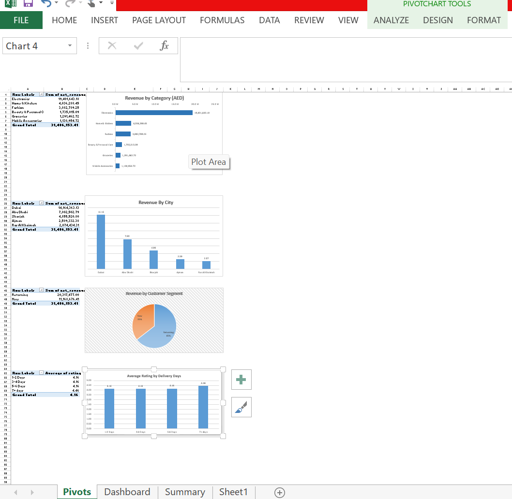

# UAE E-Commerce Sales Analysis

A data analysis project analyzing e-commerce sales patterns in the UAE, combining SQL, Excel and Tableau for interactive visualization.

## Live Dashboard

[View on Tableau Public](https://public.tableau.com/app/profile/neemah.zainab/viz/UAEE-CommerceSalesDashboard/Dashboard1)

## What's in this project

- **queries.sql** — 10 business queries (top categories, monthly revenue growth, city performance, customer segments)
- **findings.md** — Key insights from the analysis
- **ecommerce_sales_uae.csv** — The dataset used (synthetic data modeling realistic UAE e-commerce seasonal patterns)
- **Data cleaning and EDA** - Cleaning a messy sample of data( duplicates, missing values, inconsistent text, mixed dates, outliers) and exploring it with summary statistics and grouped revenue analysis.
- **excel** - Excel workbook with PivotTables, PivotCharts, KPI cards and a dashboard, plus screenshots

*Note: The python cleaning and EDA work uses a 6000 rows specifically prepared with realistic data quality issues for cleaning practice. While the SQL queries and Tableau dashboard uses the full ~49,000 row dataset.

## Excel Analysis

### Dashboard

### Pivot analysis

### Key Insights

- **Electronics drives revenue:** AED 19.4M, about 62% of the total.
- **Dubai is the top market:** about 45% of revenue, with Abu Dhabi at about 25%.
- **Returning customers matter most:** they generate about 65% of revenue.
- **Delivery speed has little effect on ratings:** 4.16 for the first three delivery bands, 4.46 for 7+ days.

## Tools used
SQL (SQLite), Tableau Public, Python (pandas, matplotlib), Excel(PivotTables, PivotCharts, Formulas)

## Author
Neemah Zainab
